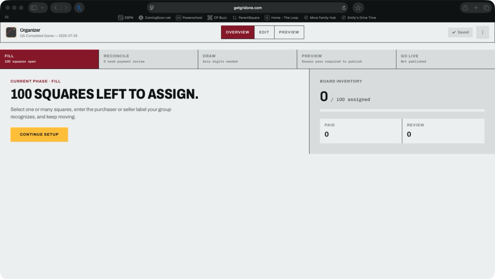
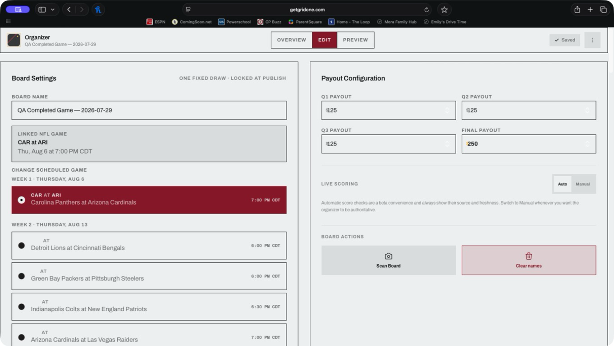
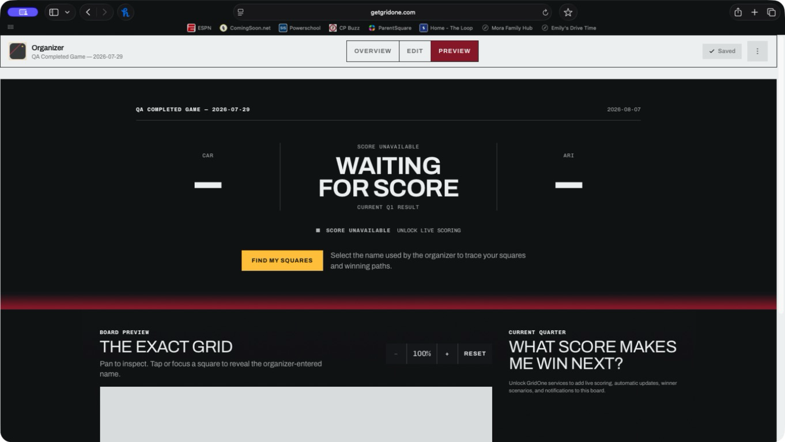
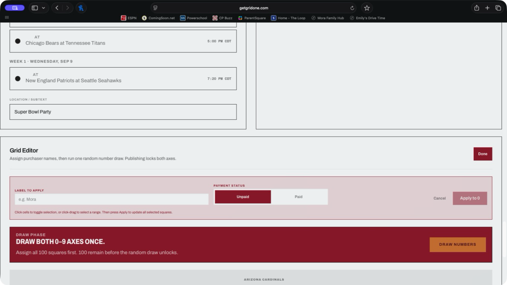

# GridOne organizer setup audit — July 29, 2026

## Audit scope

Authenticated production Safari flow for board `QA Completed Game — 2026-07-29`:

1. Overview with an empty 100-square board.
2. `Continue setup`.
3. Edit and assignment controls.
4. Draft Preview before activation.

This was a read-only audit. No square, game, payout, payment status, score, publication state, or entitlement was changed.

## User goal and accessibility target

An organizer must be able to move from an accurate board-status summary directly to the work required for that phase, complete the 10×10 grid with mouse, trackpad, touch, or keyboard, and inspect the exact draft board before paying. Focus and scrolling must make every destination apparent.

## Captured flow

### 1. Overview — partially healthy

The status is accurate and the primary action is visually clear. The action does not fulfill its promise: it opens generic Edit instead of the assignment task.

### 2. Continue setup → Edit — blocked

The full upcoming NFL schedule renders above the Grid Editor. Safari wheel/trackpad and Page Down do not move the view. The actual assignment controls are many viewports below.

### 3. Draft Preview — partially healthy

Paid services are correctly identified as locked, but an entirely empty draft is replaced by a viewer-facing empty state instead of showing the exact blank 10×10 board the organizer needs to inspect.

### 4. Assignment controls — present but unreachable through the normal path

The Grid Editor and bulk assignment controls exist and enter assignment mode. They were reached only by dragging the nested scrollbar thumb; normal scrolling and keyboard paging failed.

## Strengths

- Overview accurately reports `0 / 100 assigned`.
- The Grid Editor supports individual cells, multi-select, a label, and paid/unpaid metadata.
- Draft Preview now distinguishes the free board from paid live services.
- The accessibility tree exposes named tabs, controls, headings, and square buttons.

## Confirmed bugs and risks

### P0 — task blockers

1. **Global smooth scrolling consumes organizer wheel/touch input.** `startScrollRuntime()` starts Lenis on every route. Commissioner mode is a fixed `overflow-y-auto` container, so Lenis cancels the gesture and tries to scroll the document while the organizer content remains in the nested scroller.
2. **Continue setup is phase-blind.** Every Overview CTA calls only `setActiveTab('edit')`; Fill, Draw, Preview, and game-day phases all land at the top of the same generic screen.
3. **The primary artifact is last.** Settings, every upcoming game, payouts, scoring, scan, and clear actions appear before the Grid Editor.
4. **The game picker is always expanded and unbounded.** A board with a valid linked game still fetches and renders the entire upcoming schedule before assignment work.

### P1 — broken workflow contracts

5. **Preview and publish opens Edit, not Preview.**
6. **Reconcile sends the organizer away from the payment queue that is already on Overview.**
7. **Published/game-day boards can be sent back to Reconcile** when private payment metadata is incomplete because payment review outranks published state in `activePhase`.
8. **Payment review is simultaneously a hard phase gate and not a draw rule.** Overview blocks progression on unpaid squares, while the draw control requires only 100 assigned squares. Payment tracking should be advisory and parallel unless a single explicit rule is chosen.
9. **Empty draft Preview hides the board.** `GameDayHorizon` replaces the grid when every square is empty even though `BoardGrid` can render blank cells.
10. **Preview empty-state copy addresses the organizer as a viewer** and tells them to finish/publish rather than describing a private draft.
11. **Preview introduces another clipped/nested scroller** through an `overflow-hidden` wrapper around content that already scrolls.
12. **Navigation and save status disappear after reaching the grid** because the organizer header is not sticky.
13. **Tab changes do not reset or intentionally preserve scroll, move focus, or announce the destination.**
14. **Live-scoring controls still look operable before activation** even though automatic scoring is now gated at the client and API.
15. **Dashboard says `Locked (Unpaid)`.** That contradicts the free edit/preview model; the board is a draft with sharing and live services off, not locked.
16. **UI axis validation is weaker than publish validation.** Overview checks integer/unique/length but not the exact 0–9 range, so it can declare the draw ready and later fail publication.

## Fix plan

### 1. Establish one reliable scroll model

- Render commissioner mode in normal document flow instead of a `fixed inset-0` overlay with its own vertical scroller.
- Keep one vertical scroll owner per tab. Remove the nested Preview scroller and clipping wrapper.
- Make the organizer header sticky within the normal page.
- Scope Lenis to the cinematic landing surface, or explicitly exclude application-native scroll regions as defense in depth.

### 2. Make Overview actions phase-specific

Replace `onOpenEditor` with a typed destination:

- `assign`: open Edit, reveal Grid Editor, enter assignment mode, focus Label to Apply.
- `reconcile`: remain on Overview and focus the payment follow-up queue.
- `draw`: open Edit and focus the number-draw section.
- `preview`: open Preview and focus the exact grid.
- `scoring`: open Edit and focus the activated live-scoring controls.

Use refs plus `scrollIntoView`, a programmatically focusable heading, and a polite destination announcement. A normal tab click should scroll its tab to the top.

### 3. Reorder Edit around the organizer’s work

1. Grid Editor and assignment controls.
2. Number draw.
3. Compact board/game/payout settings.
4. Activated service controls.
5. Destructive/import actions.

Show the linked game as a compact summary. Mount/fetch the schedule only after `Change scheduled game`, collapse it after selection, and return focus to the summary.

### 4. Make draft Preview show the actual board

- Always render the 10×10 `BoardGrid` for organizer Preview, including 100 blank cells.
- Replace viewer-directed empty copy with `Private draft · sharing and live services are off`.
- Keep zoom, pan, square inspection, and Find My Squares available as soon as names exist.
- Hide notification and live-scenario controls until activation without disabling the board.

### 5. Repair lifecycle truth

- Treat payment review as a parallel private checklist, not a blocker for draw/preview.
- Make Published/Game day take precedence over payment metadata.
- Rename `Locked (Unpaid)` to `Draft · sharing off` or `Not published`.
- Present pre-activation scoring as an unavailable service card rather than active Auto/Manual controls.
- Share one exact axis-validation helper between Overview and publish validation.

### 6. Verification matrix

- Add an authenticated empty-draft browser fixture at the supplied desktop viewport.
- Verify Fill CTA lands on a visible/focused assignment label and the 10×10 grid.
- Verify wheel/trackpad-equivalent input, Page Down, keyboard tabbing, scrollbar dragging, and mobile touch scrolling.
- Verify every phase destination: Assign, Reconcile, Draw, Preview, and Scoring.
- Verify the schedule stays collapsed until requested and focus returns after selection/cancel.
- Verify empty draft Preview renders 100 cells and no viewer-directed publish message.
- Verify tab switches have deterministic scroll/focus behavior and the sticky header remains available.
- Verify unactivated boards make no score request and cannot expose scenarios/notifications/sharing.
- Verify paid/unpaid metadata does not regress a published board’s lifecycle.
- Verify UI and server axis validation accept only a unique permutation of 0–9.
- Run the browser suite in Chromium and WebKit; the current Playwright configuration exercises Chromium only.

## Evidence limits

- The production flow was inspected without changing board data, so save/reload persistence, actual bulk assignment, draw, publish, notification delivery, and payment were not executed.
- Screenshot and accessibility evidence can identify likely accessibility problems, but it does not establish full WCAG conformance.
