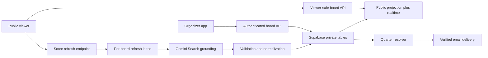

# GridOne Vision-to-Code Gap Map

> **Historical gap analysis.** Its `$4.99 / 20-board` commercial references are retired. For current product and pricing truth, use root `PRODUCT.md`, root `README.md`, and `docs/wayfinder-gridone-production-quality.md`. Preserve the findings below as historical evidence, not current instructions.

**Compared against:** `docs/greenfield-product-spec.md`
**Code state:** `main` at `bc5b7a6` plus the preserved uncommitted On Air migration

## Executive verdict

The existing repository contains valuable product DNA and a distinctive visual system, but it is not a safe incremental launch candidate as currently structured. The strongest path is a controlled rebuild of the data and server boundaries while preserving the React product surfaces, board rendering, scenario concept, winner logic, OCR capability, manual score UI, landing experience, and On Air design work.

This is not a full rewrite. It is a **foundation replacement beneath a preserved product shell**, followed by targeted workflow redesign.

## Preserve

| Capability | Existing evidence | Decision |
| --- | --- | --- |
| On Air visual system | `DESIGN.md`, `src/index.css`, current component migration | Preserve as visual authority. |
| Product-led landing motion | `components/LandingPage.tsx`, `lib/scrollRuntime.ts`, hero Playwright tests | Preserve and re-verify; do not create another Lenis owner. |
| Organizer Supabase account | `context/AuthContext.tsx`, `pages/Login.tsx`, protected routes | Preserve the account model; remove legacy board passwords. |
| Read-only shared board concept | `components/BoardView.tsx`, public `GET /api/pools/:id` projection | Preserve the viewer model and replace the unsafe data boundary. |
| 10×10 board renderer | `components/BoardGrid.tsx` | Preserve rendering/winner highlighting; redesign mobile interaction and privacy display. |
| Find My Squares | `components/board/FindSquaresModal.tsx`, `PlayerFilter.tsx` | Preserve the capability; connect it to normalized participants and accessible interactions. |
| Current-quarter scoring scenarios | `components/ScenarioPanel.tsx` | Preserve the core differentiator; personalize it and correct touch/keyboard behavior. |
| Winner digit orientation | `utils/winnerLogic.ts`, `tests/winnerLogic.test.ts` | Preserve the tested top-column/side-row mapping. |
| Manual per-quarter scoring | `hooks/useLiveScoring.ts`, `components/AdminPanel.tsx` | Preserve the model; move the canonical snapshot server-side and make manual override explicit. |
| OCR/photo import | `services/boardImportService.ts`, `functions/api/boards/scan.ts`, create/upload flows | Done: the key moved server-side. Remains a secondary recovery path behind in-app entry. |
| Entry metadata intent | `contest_entries`, `EntryMeta`, organizer paid-status UI | Preserve the organizer need; replace the cell-only model with participant/assignment/contact records. |
| Stripe-hosted payment | Checkout and signed webhook functions | Preserve Stripe Checkout; replace ownership, idempotency, and allowance logic. |

## Rework

| Area | Current mismatch | Required direction |
| --- | --- | --- |
| Database bootstrap | No migration creates `contests`; the first migration references it. | Replace with a clean, reproducible schema ordered from foundational tables outward. |
| IDs | Runtime creates eight-character string IDs while the schema expects UUID references. | UUID primary key plus unique short `share_code`. |
| Public data | Anonymous RLS can select complete contest rows, including private and payment fields. | Deny direct private-row access; publish a narrow viewer-safe projection/API. |
| Authenticated writes | Functions validate a JWT but write with an anonymous Supabase client. | Use JWT-scoped writes or service-role operations after explicit user/ownership verification. |
| Board document | Names are nested string arrays and metadata is keyed only by cell. | Normalize participants, square assignments, seller attribution, private payment state, and contacts. |
| Autosave | Whole board/settings documents are last-write-wins. | Add record-level writes and optimistic versioning/auditable mutations. |
| Automatic score | Every viewer calls Gemini directly once per minute with an exposed browser key. | One server-cached, validated, persisted score snapshot per board freshness window. |
| Viewer freshness | No realtime subscription exists. | Broadcast board, score, milestone, and notification-status changes through scoped realtime. |
| Scenario interaction | Scenarios show winner names but do not center the selected viewer; hover carries important feedback. | Personalize after Find My Squares and support tap, focus, and pointer equally. |
| Mobile board | Board forces a wide canvas with weak pan guidance and tiny names. | Add pan/zoom orientation, sticky axes, privacy-reduced cells, and tap detail. |
| Score trust | “Synced” can describe stale manual data; provider provenance/freshness is absent. | Model automatic beta, manual, stale, rejected, offline, and Final explicitly. |
| Axis model | The code supports per-quarter dynamic axes, while the confirmed launch workflow draws one set. | Use one fixed locked draw at launch; defer multiple digit sets. |
| Passcodes/recovery | Four-character board passwords, hashes, and calls to nonexistent recovery/login functions remain. | Remove the entire legacy board-passcode authority. |
| Entitlements | Allowance activation is raceable and repeated payments can stack rows. | One non-stacking 2026 entitlement with atomic activation and recovery. |
| Checkout | Anyone can create checkout for an arbitrary board ID. | Require signed-in owner and verify the owned draft board server-side. |
| Pricing | Product copy and configuration use a $4.99 one-time 2026 pass for up to 20 boards. | Keep the claim consistent; verify the live Stripe Price at final production approval. |
| Error handling | Invalid board fetches can become plausible empty boards. | Render explicit unavailable, unpublished, locked, deleted, and offline states. |
| Accessibility | Visual modals lack dialog semantics, focus containment/return, Escape behavior, and names. | Implement accessible dialog and control primitives across all flows. |
| SEO/social | Missing `/og-image.jpg`; SPA metadata is not crawler-reliable for articles. | Add the asset and produce crawlable per-route metadata/static output. |
| Policy pages | Terms/Privacy use the visit date and remain in the discarded visual world. | Use real version dates and complete the On Air migration. |
| Dependencies | Production audit reports critical/high vulnerabilities and a 1 MB entry chunk. | Upgrade/replace affected dependencies and introduce route/feature code splitting. |

## Build

| Missing capability | Why it exists in the confirmed vision |
| --- | --- |
| Native organizer board-building workflow | Creating inside GridOne—not importing paper—is the primary path. |
| Batch square assignment | Parents commonly receive 8–10 squares to sell; the organizer needs fast repeated assignment. |
| Seller/parent attribution | The organizer needs to know which parent was responsible without giving that seller an account. |
| Secure number draw and lock | Trust depends on drawing digits only after sales and proving they were not casually changed. |
| Participant identity record | One purchaser may own many squares and should be found/notified once. |
| Public notification opt-in | A viewer needs to attach a verified email to their selected board identity without an account. |
| Verification and unsubscribe | Prevents unwanted email and satisfies a credible notification workflow. |
| Notification delivery ledger | Quarter emails must be correct, retryable, observable, and idempotent. |
| Stored milestone results | Completed quarter winners must not be recomputed from a drifting provider response. |
| Score refresh lease/cache | Many viewers must collapse into one external lookup. |
| Provider validation/provenance | AI search must never silently show the wrong matchup or stale result. |
| Audit events | Number redraws, manual-score corrections, publication, and winner corrections need accountability. |
| Board archive | Finished boards remain viewable without cluttering the active organizer workflow. |

## Remove or explicitly defer

- Legacy board-password administration and recovery UI
- Viewer “claim mode” remnants
- SMS controls and phone-number storage
- Multiple digit sets by quarter
- Claims that the app updates “instantly” without a defined freshness window
- Unenforced “100 viewer cap” language; retain it only as a tested capacity target
- Legacy names, glass styling, placeholder recovery copy, and obsolete pricing statements

## Recommended implementation topology

The browser never receives service, Gemini, Stripe-secret, or email-provider credentials. Public viewers never query organizer/payment/contact rows directly.

## Delivery recommendation

1. Replace schema/auth/data boundaries.
2. Rebuild organizer creation, assignment, draw, lock, and publish on that foundation.
3. Rebuild the public viewer projection, mobile board, Find My Squares, and scenarios.
4. Add canonical scoring, realtime, milestone resolution, and manual override.
5. Add verified email subscription and idempotent winner delivery.
6. Harden the $4.99 entitlement and Stripe test-mode flow.
7. Finish accessibility, error states, On Air holdouts, SEO, dependencies, and full launch verification.

The current landing redesign can remain present throughout. The organizer and viewer experiences should move to the new foundation in vertical slices rather than maintaining two data systems.
